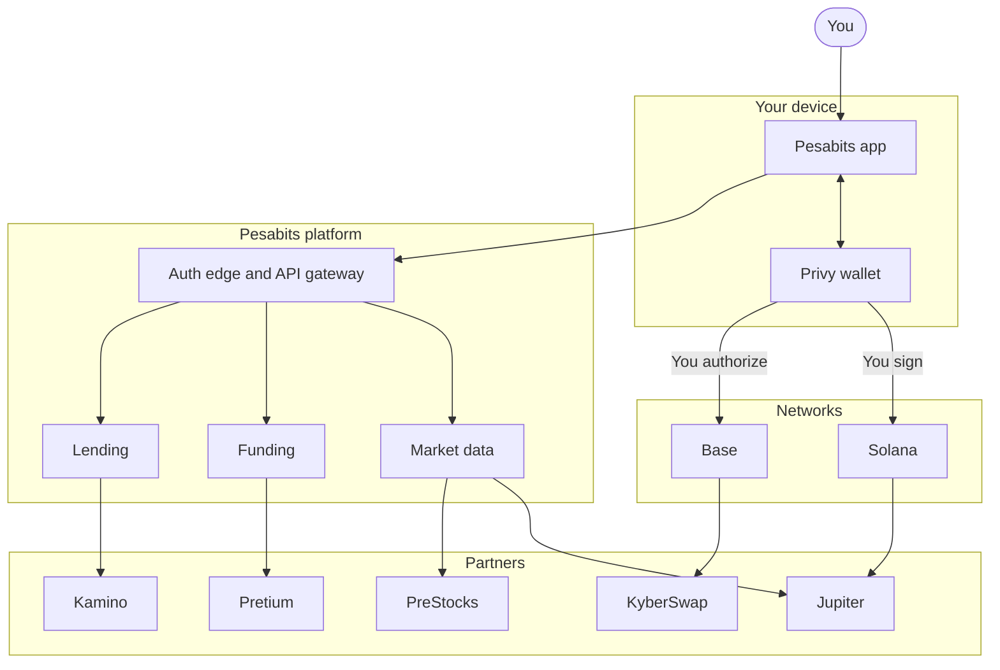
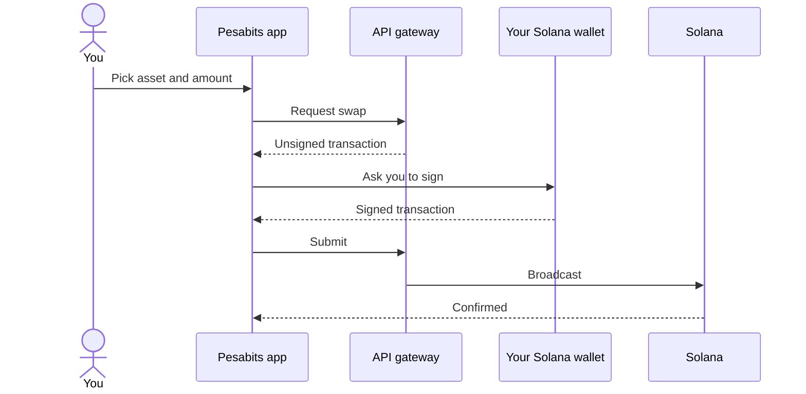
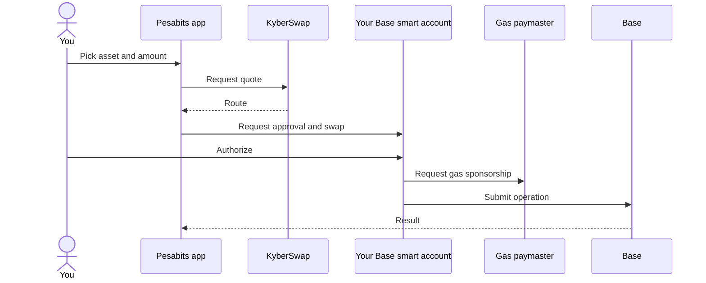
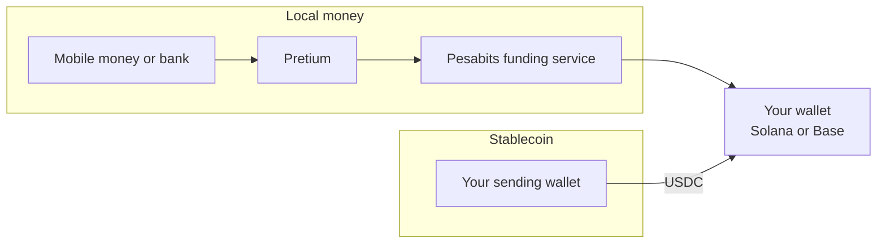

# Pesabits

**Trade stocks and pre-IPO assets from your own wallet.**

Pesabits gives you one app for stocks, PreStocks, loans, and local money in and out.
You keep your keys. You approve every trade.

---

## At a glance

| | Service | Powered by |
|:--|:--|:--|
| 01 | Buy and sell stocks | Jupiter |
| 02 | Buy and sell PreStocks | PreStocks |
| 03 | Deposit and withdraw, fiat and stablecoin | Pretium |
| 04 | Borrow against xStocks | Kamino |
| 05 | Self-custody by design | Privy |

---

## Services

### 01 &nbsp; Stocks

Buy and sell tokenized stocks on Solana.
Pesabits prepares the swap through **Jupiter**. Your wallet signs it.

- Live prices and charts in the app.
- One flow: pick an asset, enter an amount, approve.
- Base tokenized stocks trade through **KyberSwap** with the same approval step.

### 02 &nbsp; PreStocks

Buy and sell PreStocks tokens. These tokens track private companies before they list.
Pesabits reads asset data from the **PreStocks API**.

- Each asset page shows market data and a risk note.
- A PreStocks token does not give you company shares.

### 03 &nbsp; Deposit and withdraw

Move money in and out with local rails or with stablecoins.

**Fiat.** Pay with mobile money or bank transfer. **Pretium** collects the payment and settles USDC to your wallet.
To withdraw, you reverse the flow.

**Stablecoin.** Send USDC to your own address on Solana or Base.

#### Fiat coverage

| Country | Methods |
|:--|:--|
| Kenya | Safaricom, Airtel, all banks |
| Nigeria | All banks |
| Ghana | MTN, Airtel, Tigo, Telecel |
| DR Congo | Airtel Money, M-Pesa, Orange Money |
| Ethiopia | Telebirr, CBE Birr, M-Pesa |
| Uganda | MTN, Airtel |
| Malawi | Airtel, TNM Mpamba |

### 04 &nbsp; Loans

Borrow against your xStocks and keep your position.
Pesabits connects to **Kamino** on Solana. Your wallet signs the loan transaction.

[View the Kamino xStocks reserve](https://kamino.com/borrow/reserve/5wJeMrUYECGq41fxRESKALVcHnNX26TAWy4W98yULsua/4wg6rEkGgHaEuxMduP46C1xFZ24Lnp5YgdNkZAHxFzsN)

> **Note.** A loan has liquidation risk. If your collateral value falls, Kamino can sell it. Keep your loan below the limit.

### 05 &nbsp; Self-custody

Your wallet holds your assets. **Privy** provides sign-in and wallet tools.
Pesabits does not use a platform-controlled wallet for your holdings.

---

## Architecture

Four layers. Each layer does one job.

| Layer | Role |
|:--|:--|
| **Device** | The app and your Privy wallet. Signing happens here. |
| **Platform** | Sign-in, request routing, prices, funding, and loans. |
| **Partners** | Liquidity, asset data, payments, and lending. |
| **Networks** | Solana and Base. Your assets stay on these networks. |

---

## Trade flows

Solana and Base use separate execution paths. Both need your approval.

### Solana

The gateway prepares and broadcasts the transaction. It cannot sign for you.
For eligible trades, Pesabits can pay the network fee.
That fee signature does not move your assets.

### Base

Base trades run from your smart account.
The paymaster can sponsor eligible gas. It never holds your tokens.

---

## Deposit and withdraw flow

- **Fiat in.** Pretium collects your payment. Pesabits checks settlement. USDC arrives in your wallet.
- **Stablecoin in.** You send USDC to your own address.
- **Out.** You send USDC out, or you cash out to a supported local method.

---

## Custody

Direct trades are self-custodial.

| Item | Where it lives |
|:--|:--|
| Stocks, PreStocks, USDC | Your wallet |
| Signing keys | You, through Privy |
| Session and service records | Pesabits platform |
| Fiat during collection | The payment provider, until settlement |

Custody of your assets starts when settlement reaches your wallet.

---

## Partners

| Partner | What it does in Pesabits |
|:--|:--|
| **Jupiter** | Routes Solana swaps. Supplies market snapshots. |
| **PreStocks** | Supplies PreStocks asset data. |
| **Pretium** | Collects local payments and settles USDC. |
| **Kamino** | Provides loans against xStocks. |
| **Privy** | Provides sign-in and wallet tools. |
| **KyberSwap** | Routes Base swaps. |
| **Chainlink** | Supplies price feeds for Base tokenized stocks. |
| **CoinGecko, GeckoTerminal** | Supply chart history. |

---

## Platform

| Component | Role |
|:--|:--|
| **Auth edge** | Accepts browser requests and creates your session. |
| **API gateway** | Checks each request and routes it to a service. |
| **Market data** | Serves prices, snapshots, and charts. |
| **Funding** | Quotes and tracks deposits and withdrawals. |
| **Lending** | Builds loan operations for you to sign. |
| **NATS** | Connects services that work on events. |
| **PostgreSQL** | Stores service records. It does not store your tokens. |

---

## Good to know

- A PreStocks token does not give you company shares.
- Payment providers can process or route a fiat payment before it settles.
- Available payment methods depend on your country.
- Loans carry liquidation risk.
- Pesabits does not give investment advice.
